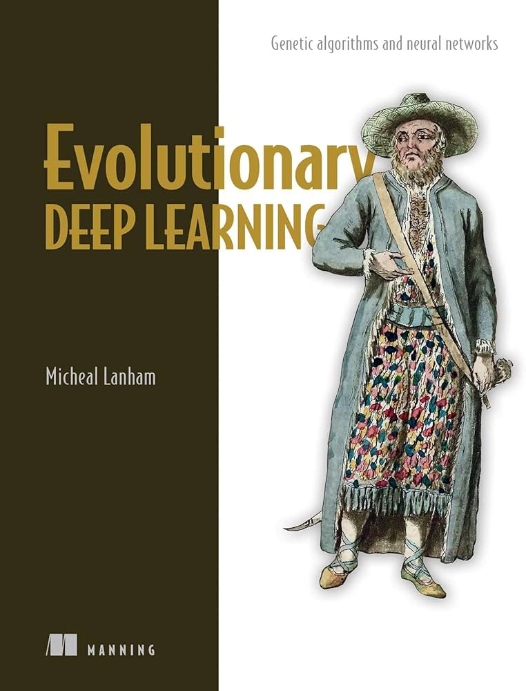

# Genetic Algorithm for OneMax Problem

In the following script we can find a **Genetic Algorithm** implemented in C++, whose model can be configured using the **config.txt** file. In it, you can find a wide range of operators to performe:

- Selection
- Crossover
- Mutation

Moreover, you can define parameters, such as: 
* POPULATION
* GENES
* MAX_ITERATIONS
* CROSSOVER PROBABILITY
* MUTATION PROBABILITY

The developed code was based on the Python **deap** library.
https://deap.readthedocs.io/en/master/

